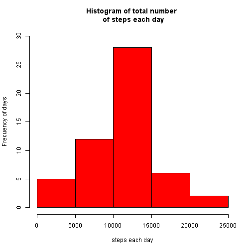
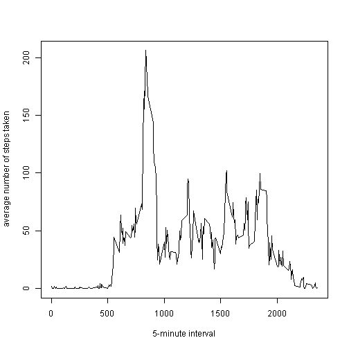
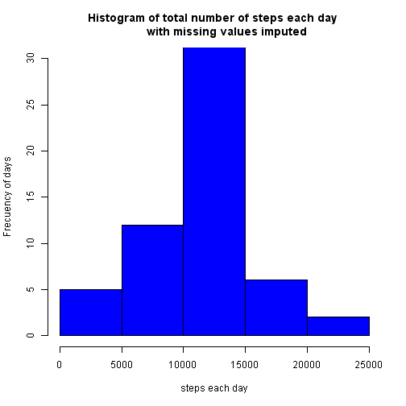
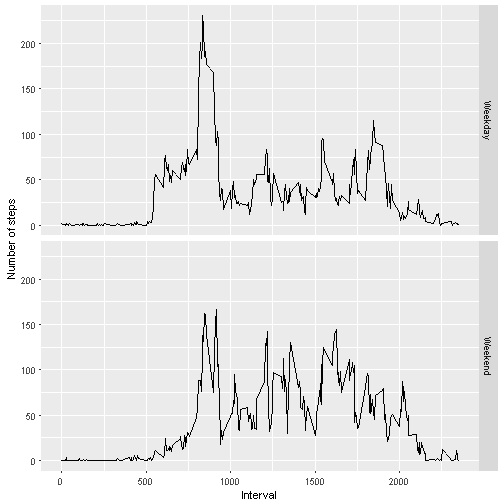

# RepData_PeerAssessment1


## Code for reading in the dataset and/or processing the data


```r
unzip("repdata-data-activity.zip")
datos <- read.csv("activity.csv", head=TRUE, sep=",", 
                  na.strings="NA")
library(lubridate)
datos$date <- as.Date(datos$date)
```

## Histogram of the total number of steps taken each day


```r
datosdia <- aggregate(steps ~ date, data=datos, FUN=sum, na.rm=TRUE)

hist(datosdia$steps, col="red", 
     xlab="steps each day", 
     ylab="Frecuency of days",
     ylim=c(0, 30), 
     main="Histogram of total number \n of steps each day")
```



## Mean and median number of steps each day


```r
cat("Mean number steps taken each day:", mean(datosdia$steps))
```

```
## Mean number steps taken each day: 10766.19
```

```r
cat("Median number steps taken each day:", median(datosdia$steps))
```

```
## Median number steps taken each day: 10765
```

## Times series plot of the average number of steps taken


```r
m <- aggregate(steps ~ interval, data=datos, FUN= mean, na.rm=TRUE)
plot(m, type="l",  xlab="5-minute interval", 
     ylab= "average number of steps taken",
     main="") 
```



## The 5-minutes interval that, on average, contains 
## the maximum number of steps


```r
mm <- subset(m, steps==max(steps))

cat("The 5-minutes interval that, on average, contains 
    the maximum number of steps is: ", mm$interval)
```

```
## The 5-minutes interval that, on average, contains 
##     the maximum number of steps is:  835
```

## Strategy for imputing missing data
## number of missing values in the dataset


```r
nas <- colSums(is.na(datos))
print("the number of missing values in the dataset is:") 
```

```
## [1] "the number of missing values in the dataset is:"
```

```r
print.table(nas)
```

```
##    steps     date interval 
##     2304        0        0
```

The strategy for filling in all of the missing values is
the mean for that 5-minutes interval


```r
datosna <- datos
for (i in 1: dim(datos)[1]) {
    if (is.na(datos$steps[i])) {
       datosna$steps[i] <- m$steps[m$interval == datos$interval[i]] 
    }
}

nana <- colSums(is.na(datosna))
print("the number of missing values in the dataset is:") 
```

```
## [1] "the number of missing values in the dataset is:"
```

```r
print.table(nana)
```

```
##    steps     date interval 
##        0        0        0
```

## Histogram of the total number of steps taken each day
## with missing values imputed


```r
datosdiana <- aggregate(steps ~ date, data=datosna, FUN=sum)

hist(datosdiana$steps, col="blue", 
     xlab="steps each day", 
     ylab="Frecuency of days",
     ylim=c(0, 30), 
     main="Histogram of total number of steps each day 
        with missing values imputed")
```



### Mean and median number of steps each day


```r
cat("Mean number steps taken each day:", mean(datosdiana$steps))
```

```
## Mean number steps taken each day: 10766.19
```

```r
cat("Median number steps taken each day:", median(datosdiana$steps))
```

```
## Median number steps taken each day: 10766.19
```

```r
print("The impact of the imputed values in the mean and median number of daily steps in almost null")
```

```
## [1] "The impact of the imputed values in the mean and median number of daily steps in almost null"
```

## New factor variable indicating whether a given data is weekday
## or weekend day


```r
week <- wday(datosna$date)
datosna$week <- as.character("")

for (i in 1: dim(datosna)[1]) {
    if (week[i]==1 | week[i]==7)  
        datosna$week[i] <- "Weekend"
    else 
	  datosna$week[i] <- "Weekday"
}  

datosna$week <- factor(datosna$week)
m2 <- aggregate(steps ~ week+interval, data=datosna, FUN= mean)
```

## Panel plot comparing the average number of steps taken per
### 5-minute interval across weekday and weekends.
## Times series plot of the average number of steps taken


```r
library(ggplot2)

qplot(interval, steps, data=m2, facets = week~. ,
      geom="line", ylab="Number of steps",
      xlab="Interval" )
```




